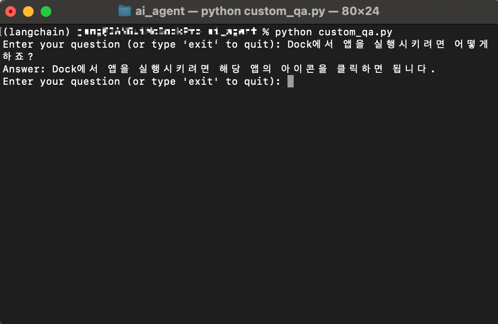

## Chatbot for PDF Document Retrieval using OpenAI GPT-3.5

OpenAI의 GPT-3.5를 사용하여 PDF 문서를 검색하는 챗봇을 구현한 코드가 포함되어 있습니다.   
  
1. 필요한 패키지를 설치합니다.
```python
pip install langchain openai pypdf chromadb tiktoken langchain-community langchain-openai
```

2. custom_qa.py 파일의 `os.environ["OPENAI_API_KEY"] = "INSERT YOUR API KEY!"` 부분에 OpenAI에서 발급받은 키 값을 입력합니다.

3. 소스코드 경로에서 터미널을 실행하여 `python custom_qa.py` 을 입력합니다.

4. 질문을 입력합니다. 응답을 종료하려면 exit를 입력합니다.

실행화면 예시
